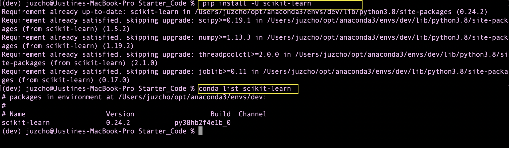
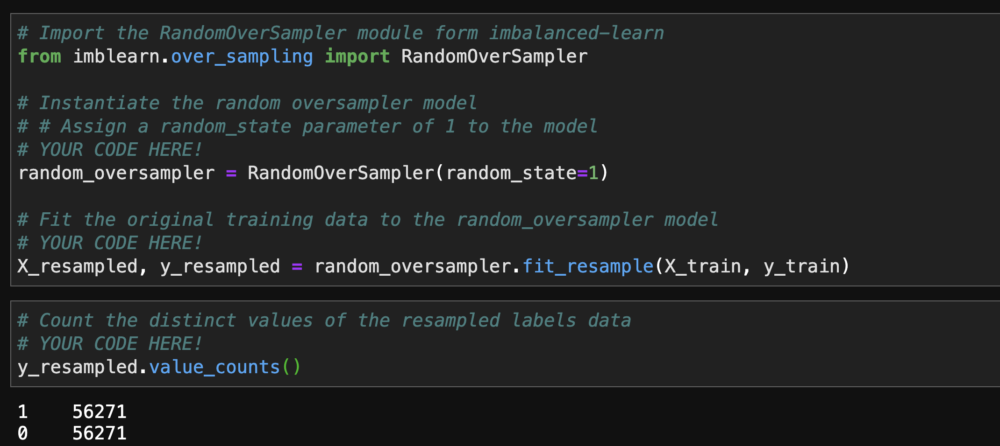
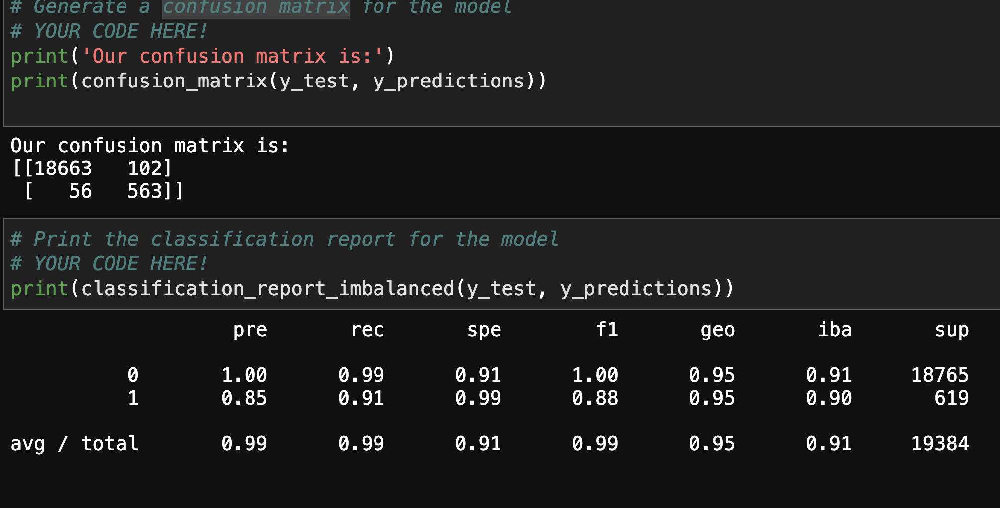
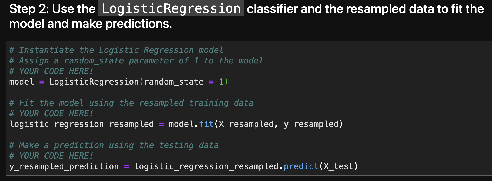

# **Credit Risk Classification**

## Overview

This classification model analysis creates a tool that can predict which loan status is healthy or high risk, to be able to help the lending company. We use Logistics Regression model and Random Oversampler to help create a machine learning classification model that can help with the purpose of identifying loans correctly.

---

## Technologies

This project leverages **[python version 3.8.5](https://www.python.org/downloads/)** with the following packages and modules:

* [pandas](https://pandas.pydata.org/docs/) - This was used to be able to easily manipulate dataframes.

* [Jupyter Lab](https://jupyterlab.readthedocs.io/en/stable/) - This was used to be able to create and share documents that contain live code, equations, visualizations and narrative text.

* [Scikit Learn](https://scikit-learn.org/stable/) - *version 0.24.2* - This package has a lot of different tools and model that could be use to create a machine learning model.
    * [scikit metrics](https://scikit-learn.org/stable/modules/model_evaluation.html) - We use the metrics to allow us to call functions such as balance accuracy score, classification matrix and confusion matrix to help us understand our data.
    *  [imbalanced-learn](https://imbalanced-learn.org/stable/) - *version 0.8.0* - This is one of the packages that was use to the random oversampler tool.
    *  [linear model](https://scikit-learn.org/stable/modules/linear_model.html) - This allows the model to call the Logisitic Regression model to run our machine learning.
---
## Installation Guide

### 1. Installing and Running Jupyter notebook

On the terminal, under the conda dev environment, type the code below:

`pip install jupyterlab`

#### * Opening Jupyter notebook

If you have Jupyter Lab already installed, to open your Notebook and be able to view your hidden files, please type this while on your conda dev environment:

`jupyter lab --ContentsManager.allow_hidden=True` 

Once you click ENTER, this will open on your default browser.

---

### 2. Installing Scikit-learn
- To install the Scikit-learn, check that your development environment is active, and then run the following command:

    `pip install -U scikit-learn`

- To check if scikit-learn is already installed, you can run the following code on your dev environment:

    `conda list scikit-learn`

   

- To install our imbalance-learn, check that your development environment is active, and then run the following command:

    `conda install -c conda-forge imbalanced-learn`

- To check if imbalance-learn is already installed, you can run the following code on your dev environment:

    `conda list imbalanced-learn`

---
## Examples

Here are some of the data we did for this model.
   
 
---

   

---

## Usage

To be able to get a good analysis on the credit risk classification, we need to be able to model, fit and predict using Logistic Regression and with same model but with an oversampled data.

   

---

## Contributors

Contributed by: Justine Cho

Email: juz317_cho@yahoo.com

[ LinkedIn](https://www.linkedin.com/in/justinecho)

---

## License

### **MIT License**

Copyright (c) [2021] [Justine Cho]

Permission is hereby granted, free of charge, to any person obtaining a copy
of this software and associated documentation files (the "Software"), to deal
in the Software without restriction, including without limitation the rights
to use, copy, modify, merge, publish, distribute, sublicense, and/or sell
copies of the Software, and to permit persons to whom the Software is
furnished to do so, subject to the following conditions:

The above copyright notice and this permission notice shall be included in all
copies or substantial portions of the Software.

THE SOFTWARE IS PROVIDED "AS IS", WITHOUT WARRANTY OF ANY KIND, EXPRESS OR
IMPLIED, INCLUDING BUT NOT LIMITED TO THE WARRANTIES OF MERCHANTABILITY,
FITNESS FOR A PARTICULAR PURPOSE AND NONINFRINGEMENT. IN NO EVENT SHALL THE
AUTHORS OR COPYRIGHT HOLDERS BE LIABLE FOR ANY CLAIM, DAMAGES OR OTHER
LIABILITY, WHETHER IN AN ACTION OF CONTRACT, TORT OR OTHERWISE, ARISING FROM,
OUT OF OR IN CONNECTION WITH THE SOFTWARE OR THE USE OR OTHER DEALINGS IN THE
SOFTWARE.
